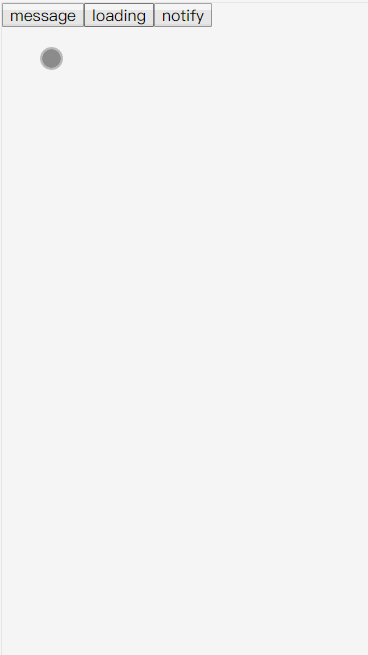

<h1 align="center" style="color: #61dafb;">react-render-api</h1>

<h1 align="center" style="font-size: 80px;color:#61dafb">🔌</h1>

<p align="center">render your react components through call api</p>


<br>

## 📋`Introduction`

by calling api to render react components as separate instance, you can easily use react to implement common functions such as modal, drawer, tips, and so on!

<br>

<br>

## 🎨`example`

Below is a message component implemented by react-render-api



<br>

<br>

## 📦`install`

```shell
npm install @lxjx/react-render-api
# or
yarn add @lxjx/react-render-api
```

<br>

<br>

## 🗺guide

### createRenderApi

创建一个render api

```typescript
const renderApi = createRenderApi<ApiOptions>(Component, Option);

// ApiOptions: api的配置参数

/* 创建时的配置 */
interface Option: {
  /** 包裹元素，如果传入，会用其对渲染出来的组件进行包裹 */
  wrap?: ComponentType<any>;
  /** 最大实例数，调用api创建的实例数超过此数值时，会移除最先创建实例, 遵循“先进先出” */
  maxInstance?: number;
}
```

<br>

### renderApi

生成组件实例，由 createRenderApi 生成

```typescript
const [ref, id] = renderApi(options)

// options: 
// renderApi创建后，配置项除了渲染组件本身的Props外，还包含一下额外的配置项
interface ReactRenderApiExtraProps {
  /** 相同api下每次只会存在一个实例 */
  singleton?: boolean;
}

// ref: 
interface ReactRenderApiInstance {
  /** 关闭指定实例 */
  close: (id: number) => void;
  /** 关闭所有实例 */
  closeAll: () => void;
}

// id: 实例id
```


<br>

## 其他

### 替换整个state

内置`{ type: 'ReplaceRootState' }`, 可以使用它对根state进行替换

```js
dispatch({
    type: 'replaceRootState',
    user: {...},
    list: {...},
})
```

<br>

### setState

内置`{ type: 'setState/[namespace]' }`, 可以快捷的对某个model的state进行设置

```js
dispatch({
    type: 'setState/user',
    name: '123'
})
           
dispatch({
    type: 'setState/list',
    list: [1, 2, 3, 4]
})
```
<br>

### devtool
在满足 `window && window.__REDUX_DEVTOOLS_EXTENSION_COMPOSE__ && process.env.NODE_ENV === 'development'`时，会默认开启devtool的支持

<br>

### 连锁effect 

每个effect都是一个async函数，所以可以将它们任意的组合使用

```js
effects: {
    async getUserInfo(action, { dispatch }) {
        console.log(1);

        await delay(1000);

        console.log(2);

        dispatch(m1.reducers.put, 'effect set');

        console.log(3);

        await delay(1000);

        console.log(4);

        await dispatch(m2.effects.getUserInfo2);

        console.log(6);

        return 7;
    },
    async getUserInfo2() {
        await delay(1000);
        console.log(5);
    },
}

// trigger
dispatch(xx.effects.getUserInfo)
	.then(res => console.log(res));      

/* 
    1
    // waiting 1s
    2
    
    3
    
    // waiting 1s
    4
    
    -> lists/changeList2
    
    // waiting 1s
    5
    
    6
    
    effect end
    
    7
*/
```

<br >
<br >

## 额外的增强器和中间件
r2内置了一些常用的增强器和中间件，你可以在需要的时候引入它们并使用。
### redux-cache
```js
import { reduxCacheFactory } from '@lxjx/r2';

createStoreEnhance<AppState>({
  models: {
    user,
    home,
  },
  enhancer: reduxCacheFactory({ includes: ['user'] }), // 也可用于常规的createStore
});
```
interface
```js
interface ReduxCacheFactory {
  (options?: {
    /** 用于存储到sessionStorage的key */
    cacheKey?: string;
    /** 当此项长度大于0时，只会缓存该数组内指定的key */
    includes?: any[];
  }): StoreEnhancer;
}
```


