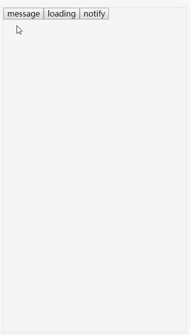

<h1 align="center" style="color: #61dafb;">react-render-api</h1>

<h1 align="center" style="font-size: 80px;color:#61dafb">🔌</h1>

<p align="center">render your react components through call api</p>


<br>

## 📋`Introduction`

by calling api to render react components as separate instance, you can easily use react to implement common functions such as modal, drawer, tips, and so on!

<br>

<br>

## 🎨`example`

Below is a message component implemented by react-render-api



<br>

<br>

## 📦`install`

```shell
npm install @lxjx/react-render-api
# or
yarn add @lxjx/react-render-api
```

<br>

<br>

## 🗺useage

1. create ur component

```tsx
const Demo = (props: ReactRenderApiProps) => {
    
  React.useEffect(() => {
    if (props.show) {
      // hidden after one second
      setTimeout(() => props.onClose && props.onClose(), 1000);
    } else {
      // remove current instance after one second(prevent damage to animation)
      setTimeout(() => props.onRemove && props.onRemove(), 1000);
    }
  }, [props.show]);

  return (
    <div style={{ opacity: props.show ? 1 : 0, transition: '0.5s' }}>
      <div>{props.title}</div>
      <div>{props.desc}</div>
    </div>
  );
};
```

2. create renderApi

```tsx
import Demo from './Demo';
import createRenderApi from '@lxjx/react-render-api';

type Option = {
    title: string;
    desc?: string;
}

const renderApi = createRenderApi<Option>(Demo);

renderApi({
    title: 'im a title...',
    singleton: true, // only one instance can exist at the same time
})
```

<br>

<br>

## 📜`API`

### createRenderApi

创建一个render api

```typescript
const renderApi = createRenderApi<ApiOptions>(Component, Option);
// ApiOptions: api的配置参数

/* 创建时的配置 */
interface Option: {
  /** 包裹元素，如果传入，会用其对渲染出来的组件进行包裹 */
  wrap?: ComponentType<any>;
  /** 最大实例数，调用api创建的实例数超过此数值时，会移除最先创建实例, 遵循“先进先出” */
  maxInstance?: number;
}
```

<br>

### renderApi

生成组件实例，由 createRenderApi 生成

```typescript
const [ref, id] = renderApi(options)

// options: 
// renderApi创建后，配置项除了渲染组件本身的Props外，还包含以下额外的配置项
interface ReactRenderApiExtraProps {
  /** 相同api下每次只会存在一个实例 */
  singleton?: boolean;
}

// ref: 
interface ReactRenderApiInstance {
  /** 关闭指定实例 */
  close: (id: number) => void;
  /** 关闭所有实例 */
  closeAll: () => void;
}

// id: 实例id
```

<br>

### 传递给组件的props

传入实例组件中的额外prop

```ts
interface ReactRenderApiProps {
  /** 实例组件是否显示 */
  show?: boolean;
  /** 从实例列表移除指定实例, 如果组件带关闭动画，请先使用onClose，然后再show = false时执行关闭动画并在合适的时机执行此方法来移除实例 */
  onRemove?: () => void;
  /** 将该项的show设置为false */
  onClose?: () => void;
}
```


